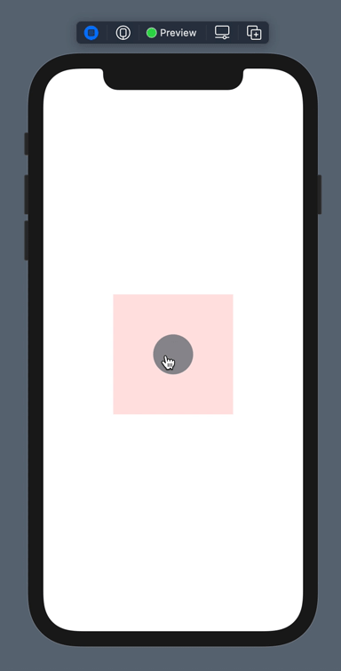

# RubberDrag

A gesture that enables dragging on a view with a "rubberband" effect, similar to Apple's native scrollview or half sheet interaction.



## Usage
Download RubberDrag.swift and drop it into your project.

```swift
import SwiftUI

struct ContentView: View {    
    var body: some View {
   	Circle()
	.rubberDrag(dragLimit: 100)
   }
}
```
You can optionally disable horizontal or vertical dragging

```swift
import SwiftUI

struct ContentView: View {    
    var body: some View {
   	Circle()
	.rubberDrag(dragLimit: 100, horizontalEnabled: false, verticalEnabled: true)
   }
}
```

## License

You can use this software under the terms and conditions of the MIT License.

Joe Kennedy © 2021
